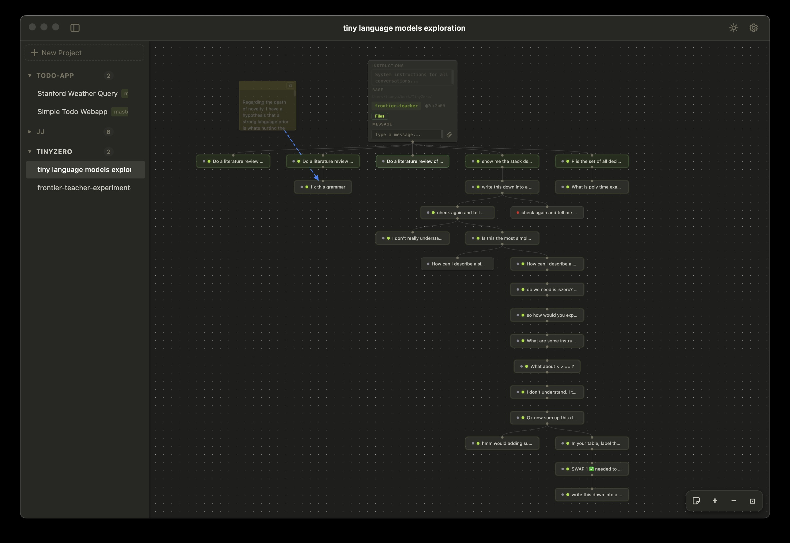
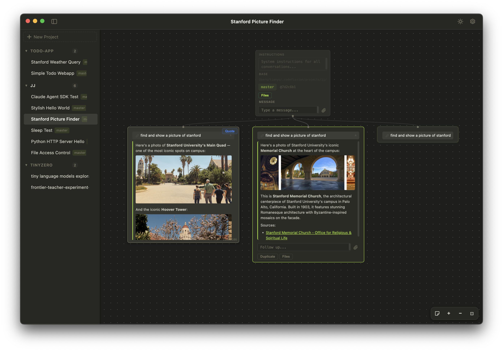
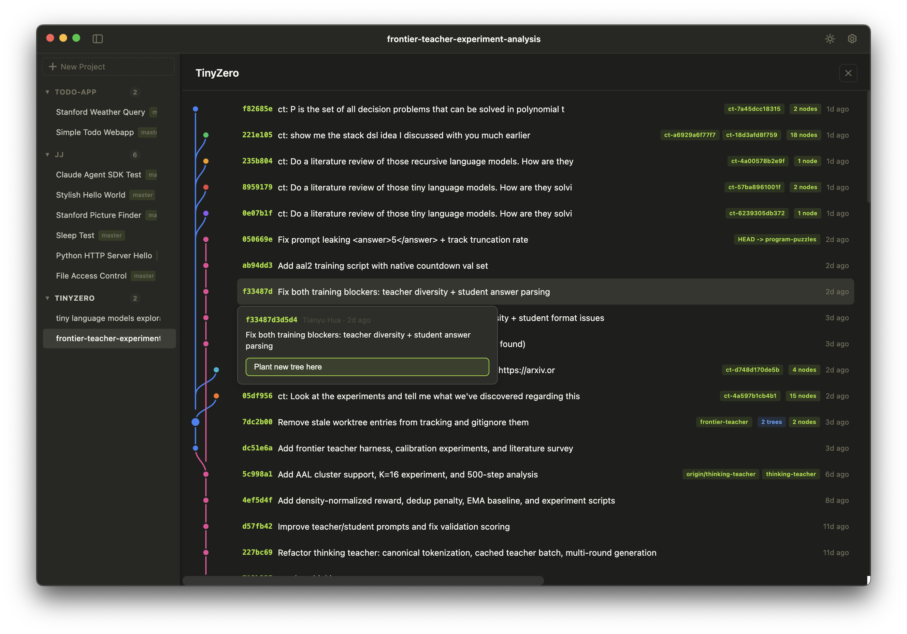

# CodeFission

Tree-structured AI coding assistant. Each conversation node is an isolated git worktree — branch conversations to explore alternative approaches, and each branch gets its own filesystem sandbox.

## Example: research workflow

The canvas works for open-ended research too: branch from a root prompt, iterate on sub-questions, and keep parallel threads visible — sticky notes and deep trees included.



## Example: duplicating a session

Use **Duplicate** on a node to spin up another branch from the same starting point — handy when you want the same prompt but different tool runs, follow-ups, or outcomes side by side.



## Example: start a tree from commit history

Open the **git graph** view for a project to see branches and commits. Pick any commit and use **Plant new tree here** to spin up a new conversation tree rooted at that exact revision — useful for revisiting an older state or exploring “what if” from a specific point in history.



## Prerequisites

- **[uv](https://docs.astral.sh/uv/)** — Python package manager (used to install CodeFission)
- **An AI backend** — Claude Code or Codex CLI (**you only need one**)
- **[git](https://git-scm.com/downloads)** — worktree isolation. Usually pre-installed.

### Install uv

uv is a fast Python package manager. If you don't have it:

```bash
# macOS / Linux
curl -LsSf https://astral.sh/uv/install.sh | sh

# Windows
powershell -ExecutionPolicy ByPass -c "irm https://astral.sh/uv/install.ps1 | iex"
```

> You don't need to install Python separately — uv manages that for you.

### Authenticate Claude Code

Install and log in with your Anthropic account (Claude Pro/Max) or API key:

```bash
npm install -g @anthropic-ai/claude-code
claude login
```

Alternatively, set `ANTHROPIC_API_KEY` in your environment.

### Authenticate Codex CLI

Install and log in with your OpenAI account:

```bash
npm install -g @openai/codex
```

Then authenticate using one of:

```bash
codex login              # OpenAI API key (paid API access)
codex login --chatgpt    # ChatGPT Plus or Pro account
```

Alternatively, set `OPENAI_API_KEY` in your environment.


## Install

```bash
uv tool install codefission
```

This installs `fission` as a standalone command on your system. uv creates an isolated environment for it automatically — no Python environment management needed on your end.

> **Prefer pip?** `pip install codefission` works too.

Then run:

```
fission
```

Opens as a desktop app on first launch (downloads ~80 MB once). Use `fission --browser` to open in a browser instead.

```
fission              # desktop app (default)
fission --browser    # browser mode
fission --desktop    # force desktop app
```

### Updates

When a new version is available, `fission` will notify you on launch and offer to upgrade automatically. You can also check manually:

```
fission --update
```

## Install from source

Requires [uv](https://docs.astral.sh/uv/installation/) and [Node.js](https://nodejs.org/en/download) 20.19+ or 22.12+.

```
git clone https://github.com/codefission-ai/CodeFission.git
cd CodeFission
make install
fission
```

For development with auto frontend rebuild:

```
make dev
```

## How it works

Create a tree in the sidebar, type a message, and CodeFission spawns a Claude Code session in an isolated git worktree. Branch any node to explore alternatives — each branch forks the conversation context and the filesystem state.

```
         [root]
        /      \
   [add auth]  [add auth]     <- same prompt, different approaches
      |            |
 [fix tests]  [add logging]   <- independent follow-ups
```

Every node tracks its git branch, commit, and Claude session. Child nodes fork from the parent's prompt cache so context carries over without re-sending history.

## Authentication

Configurable in the Settings panel (gear icon in sidebar):

- **CLI (OAuth)** — default. Uses your `claude login` session. No API key needed.
- **API Key** — provide an Anthropic API key in settings. Useful for headless/remote setups.

Both modes require the Claude Code CLI binary to be installed.

## Configuration

Open Settings (gear icon) to configure:

- **Global defaults** — provider, model, max turns, auth mode. Applies to all trees.
- **Per-tree overrides** — provider, model, max turns. Leave as "Default" to inherit global settings.

Settings persist in the backend database across sessions and devices.

## Development

```
make dev          # install + build frontend + run server
make test         # run tests
make build        # build wheel for PyPI
make publish      # build + upload to PyPI
make clean        # remove build artifacts
```

Frontend dev server (hot reload):

```
cd ui
npm run dev
```

Data is stored in `~/.codefission/` (SQLite database, git worktrees). Override with `CODEFISSION_DATA_DIR` env var.

## Platform support

| Platform | Status |
|----------|--------|
| macOS | Tested |
| Linux | Tested |
| Windows | Not tested — may work, but no guarantees |

> **Windows users:** if you hit issues, [open a GitHub issue](https://github.com/codefission-ai/CodeFission/issues) and I'll respond within 3 hours.

## Support

Found a bug or something not working? [Open an issue](https://github.com/codefission-ai/CodeFission/issues) — I respond to all issues within 3 hours.
